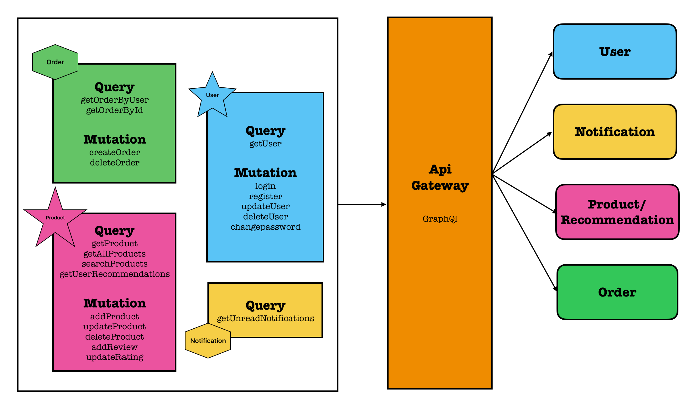
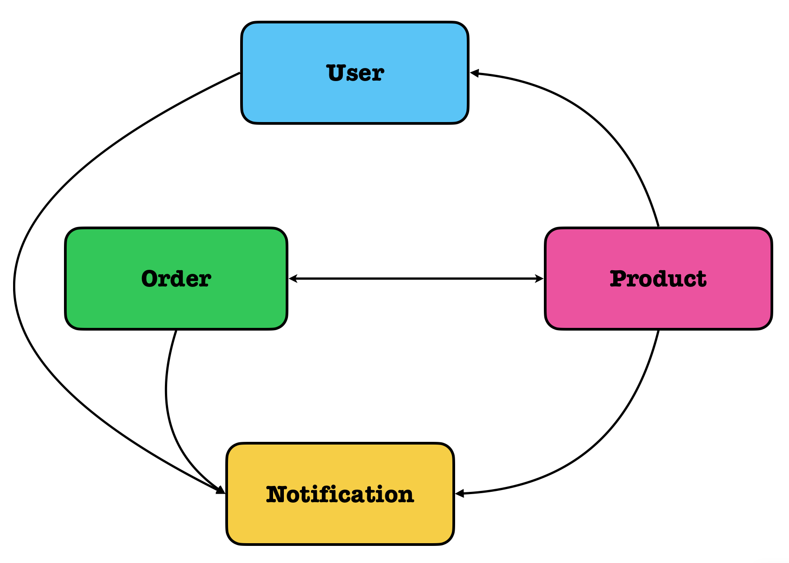
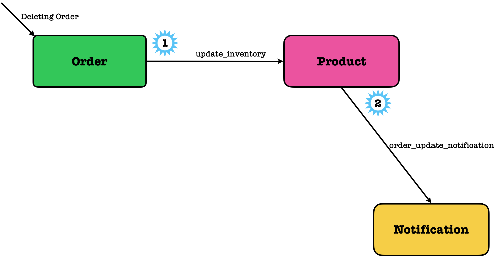

# Personalized Notification System - Architecture Overview

## 🛠 System Overview

A simple microservices-based project for sending personalized notifications on an e-commerce platform. Everything runs through Docker containers, communicating via RabbitMQ, and exposed through a single GraphQL API Gateway.

### ✅ Microservices:

- **User Service** — user signup, preferences, and profile
- **Notification Service** — stores and sends notifications
- **Order Service** — manages mock orders and emits order updates
- **Product Service** — handles product data and simple recommendations
- **GraphQL API Gateway** — unified client interface, JWT-based authentication
- **RabbitMQ** — messaging system for async communication

## Architecture Diagram

<p align="center">
  
  
</p>


## Quick Start Guide

### 1️⃣ Clone the repository:
```bash
git clone https://github.com/akhilsaisriram/pratilipi_intern.git
cd pratilipi_intern
```

### 2️⃣ Add a `.env` file in the root directory:
```env
MONGO_USERNAME=your_mongo_username
MONGO_PASSWORD=your_mongo_password
MONGO_PORT=27017
JWT_SECRET=your_secret_key
BASE_URL=http://<your-ip>
```

### 3️⃣ Build and run all services:
```bash
docker-compose build
docker-compose up
```

## 🧪 Testing

Import the provided Postman collection from the repository root.

Test all endpoints using http://localhost:8080/graphql.

### Services:
- User Service: `http://<your-ip>:3000`
- Notification Service: `http://<your-ip>:3001`
- Order Service: `http://<your-ip>:3002`
- Product Service: `http://<your-ip>:3003`
- GraphQL Gateway: `http://<your-ip>:8080/graphql`
- RabbitMQ Dashboard: `http://<your-ip>:15672` (guest / guest)

### Services Communication Flow:

#### User place an order 
<p align="center">
  
  
</p>
<p align="center">
  <em>Left: Place Order Flow &nbsp;&nbsp;&nbsp;&nbsp; Right: Delete Order Flow</em>
</p>


####  Flow: Order Processing & Notifications

#### User places an order through Order Service
1. Order Service sends inventory check message to Product Service via RabbitMQ
2. Product Service:
   - Verifies inventory availability
   - Updates product recommendations based on user preferences and sends them to the Notification Service if the user has enabled recommendations in the order
   - Sends order response back through RabbitMQ
3. If inventory is sufficient and user has notifications enabled:
   - Order Service pushes order data to Notification Service 
    
4. Notification emails order confirmation and recommendations; stores notification as unread

#### Delete Order Flow

1. Order requests inventory update from Product
2. Product adjusts stock and notifies Notification
3. Notification emails cancellation info and stores it


